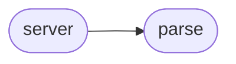

# Displacy Service Server

[_Documentation generated by Documatic_](https://www.documatic.com)

<!---Documatic-section-Codebase Structure-start--->
## Codebase Structure

<!---Documatic-block-system_architecture-start--->

<!---Documatic-block-system_architecture-end--->

# #
<!---Documatic-section-Codebase Structure-end--->

<!---Documatic-section-displacy_service.server.get_model-start--->
## displacy_service.server.get_model

<!---Documatic-section-get_model-start--->
<!---Documatic-block-displacy_service.server.get_model-start--->
<details>
	<summary><code>displacy_service.server.get_model</code> code snippet</summary>

```python
def get_model(model_name):
    if model_name not in _models:
        _models[model_name] = spacy.load(model_name)
    return _models[model_name]
```
</details>
<!---Documatic-block-displacy_service.server.get_model-end--->
<!---Documatic-section-get_model-end--->

# #
<!---Documatic-section-displacy_service.server.get_model-end--->

<!---Documatic-section-displacy_service.server.get_dep_types-start--->
## displacy_service.server.get_dep_types

<!---Documatic-section-get_dep_types-start--->
<!---Documatic-block-displacy_service.server.get_dep_types-start--->
<details>
	<summary><code>displacy_service.server.get_dep_types</code> code snippet</summary>

```python
def get_dep_types(model):
    labels = []
    for label_id in model.parser.moves.freqs[DEP]:
        labels.append(model.vocab.strings[label_id])
    return labels
```
</details>
<!---Documatic-block-displacy_service.server.get_dep_types-end--->
<!---Documatic-section-get_dep_types-end--->

# #
<!---Documatic-section-displacy_service.server.get_dep_types-end--->

<!---Documatic-section-displacy_service.server.get_ent_types-start--->
## displacy_service.server.get_ent_types

<!---Documatic-section-get_ent_types-start--->
<!---Documatic-block-displacy_service.server.get_ent_types-start--->
<details>
	<summary><code>displacy_service.server.get_ent_types</code> code snippet</summary>

```python
def get_ent_types(model):
    labels = []
    for label_id in model.entity.moves.freqs[ENT_TYPE]:
        labels.append(model.vocab.strings[label_id])
    return labels
```
</details>
<!---Documatic-block-displacy_service.server.get_ent_types-end--->
<!---Documatic-section-get_ent_types-end--->

# #
<!---Documatic-section-displacy_service.server.get_ent_types-end--->

<!---Documatic-section-displacy_service.server.get_pos_types-start--->
## displacy_service.server.get_pos_types

<!---Documatic-section-get_pos_types-start--->
<!---Documatic-block-displacy_service.server.get_pos_types-start--->
<details>
	<summary><code>displacy_service.server.get_pos_types</code> code snippet</summary>

```python
def get_pos_types(model):
    labels = []
    for label_id in model.tagger.moves.freqs[TAG]:
        labels.append(model.vocab.strings[label_id])
    return labels
```
</details>
<!---Documatic-block-displacy_service.server.get_pos_types-end--->
<!---Documatic-section-get_pos_types-end--->

# #
<!---Documatic-section-displacy_service.server.get_pos_types-end--->

[_Documentation generated by Documatic_](https://www.documatic.com)