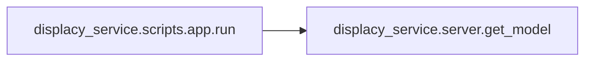

# Key Objects

[_Documentation generated by Documatic_](https://www.documatic.com)

<!---Documatic-section-displacy_service.server.get_ent_types-start--->
## displacy_service.server.get_ent_types

<!---Documatic-section-get_ent_types-start--->
<!---Documatic-block-displacy_service.server.get_ent_types-start--->
<details>
	<summary><code>displacy_service.server.get_ent_types</code> code snippet</summary>

```python
def get_ent_types(model):
    labels = []
    for label_id in model.entity.moves.freqs[ENT_TYPE]:
        labels.append(model.vocab.strings[label_id])
    return labels
```
</details>
<!---Documatic-block-displacy_service.server.get_ent_types-end--->
<!---Documatic-section-get_ent_types-end--->

# #
<!---Documatic-section-displacy_service.server.get_ent_types-end--->

<!---Documatic-section-displacy_service.scripts.app.run-start--->
## displacy_service.scripts.app.run

<!---Documatic-section-run-start--->


### Object Calls

* displacy_service.server.get_model

<!---Documatic-block-displacy_service.scripts.app.run-start--->
<details>
	<summary><code>displacy_service.scripts.app.run</code> code snippet</summary>

```python
def run():
    for model in MODELS:
        print('Load model ', model)
        loaded_model = get_model(model)
        special_cases_str = os.getenv(f'{model}_special_cases', '')
        if special_cases_str:
            for special_case in special_cases_str.split(','):
                loaded_model.tokenizer.add_special_case(special_case, [{ORTH: special_case}])
    print('Loaded all models. Starting HTTP server.')
    httpd = simple_server.make_server('0.0.0.0', 8000, APP)
    httpd.serve_forever()
```
</details>
<!---Documatic-block-displacy_service.scripts.app.run-end--->
<!---Documatic-section-run-end--->

# #
<!---Documatic-section-displacy_service.scripts.app.run-end--->

<!---Documatic-section-displacy_service.server.get_model-start--->
## displacy_service.server.get_model

<!---Documatic-section-get_model-start--->
<!---Documatic-block-displacy_service.server.get_model-start--->
<details>
	<summary><code>displacy_service.server.get_model</code> code snippet</summary>

```python
def get_model(model_name):
    if model_name not in _models:
        _models[model_name] = spacy.load(model_name)
    return _models[model_name]
```
</details>
<!---Documatic-block-displacy_service.server.get_model-end--->
<!---Documatic-section-get_model-end--->

# #
<!---Documatic-section-displacy_service.server.get_model-end--->

<!---Documatic-section-displacy_service.server.get_pos_types-start--->
## displacy_service.server.get_pos_types

<!---Documatic-section-get_pos_types-start--->
<!---Documatic-block-displacy_service.server.get_pos_types-start--->
<details>
	<summary><code>displacy_service.server.get_pos_types</code> code snippet</summary>

```python
def get_pos_types(model):
    labels = []
    for label_id in model.tagger.moves.freqs[TAG]:
        labels.append(model.vocab.strings[label_id])
    return labels
```
</details>
<!---Documatic-block-displacy_service.server.get_pos_types-end--->
<!---Documatic-section-get_pos_types-end--->

# #
<!---Documatic-section-displacy_service.server.get_pos_types-end--->

<!---Documatic-section-displacy_service.server.get_dep_types-start--->
## displacy_service.server.get_dep_types

<!---Documatic-section-get_dep_types-start--->
<!---Documatic-block-displacy_service.server.get_dep_types-start--->
<details>
	<summary><code>displacy_service.server.get_dep_types</code> code snippet</summary>

```python
def get_dep_types(model):
    labels = []
    for label_id in model.parser.moves.freqs[DEP]:
        labels.append(model.vocab.strings[label_id])
    return labels
```
</details>
<!---Documatic-block-displacy_service.server.get_dep_types-end--->
<!---Documatic-section-get_dep_types-end--->

# #
<!---Documatic-section-displacy_service.server.get_dep_types-end--->

<!---Documatic-section-displacy_service.scripts.download.download_models-start--->
## displacy_service.scripts.download.download_models

<!---Documatic-section-download_models-start--->
<!---Documatic-block-displacy_service.scripts.download.download_models-start--->
<details>
	<summary><code>displacy_service.scripts.download.download_models</code> code snippet</summary>

```python
def download_models():
    languages = os.getenv('languages', 'en').split()
    for lang in languages:
        download(model=lang, direct=False)
    print('Updating frontend settings...')
    frontend_settings = json.load(open('frontend/_data.json'))
    frontend_settings['index']['languages'] = {l: l for l in languages}
    frontend_settings['index']['default_language'] = languages[0]
    json.dump(frontend_settings, open('frontend/_data.json', 'w'), sort_keys=True, indent=2)
    print('Done!')
```
</details>
<!---Documatic-block-displacy_service.scripts.download.download_models-end--->
<!---Documatic-section-download_models-end--->

# #
<!---Documatic-section-displacy_service.scripts.download.download_models-end--->

[_Documentation generated by Documatic_](https://www.documatic.com)